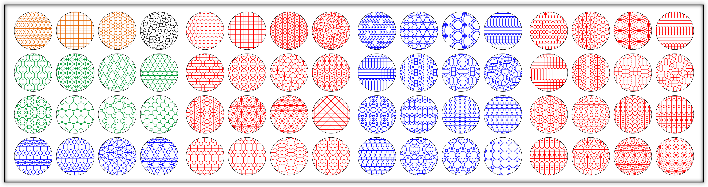

# A data-driven framework for structure-property correlation in ordered and disordered cellular metamaterials
This repository provides data and associated codes for a data-driven framework that enables prediction of macroscopic properties of 2D cellular metamaterials, and identifies their connection to key morphological characteristics, as identified by the integration of machine-learning models (Random Forest and GAM) and interpretability algorithms (SHAP analysis).

## Table of Contents
- [Data](#data)
- [Code Overview](#code-overview)
- [Prerequisites](#prerequisites)
- [Contributors](#contributors)
- [Contact](#contact)
  
## Data
### Microstructure Data

The microstructural data contains 1646 different tessellations, both ordered and disordered. For visualization, each tessellation is represented by the corresponding nodes and connectivity (in the *Tessellation Dataset* folder), and two demos are provided to display the tessellation and/or microstructure.

> `Tessellation_Demo.m` Display of tessellation for a certain sample in the dataset.

> `Microstructure_Demo.m` Display of microstructure for a certain sample for a given relative density in the dataset.

### Structure-Property Data

The structure-property data contains 42 microstructural features, the corresponding effective stiffness for 1646 different tessellations at 5 different relative densities, which in total consists of 8230 microstructures with 43 parameters.

> `Structure-Property-Data.csv` Each column represents a property, as listed in the header. Every five rows correspond to a distinct topology with five  relative densities, using the same sample index as in *Tessellation Dataset*.

## Code Overview
1. `Virtual microstructure generation` Generation of cellular microstructures.
2. `Feature and property measurement` Extraction of features and stiffness calculation for each cellular metamaterial in the dataset.
3. `Data Preparation` Generation of accessible data files for machine learning algorithms.
4. `Random Forest and SHAP` Random forest regression model for stiffness prediction and utilization of SHAP analysis for structure-property correlation.
5. `Generalized Additive Model` Generalized additive model for stiffness prediction and structure-property correlation.

## Prerequisites
- Matlab (R2020a or later, full toolbox installation recommended)
- Simulia Abaqus (2021)
- Python (3.8 or later)
- R (3.6.1 or later)

## Contributors
Shengzhi Luan, Enze Chen, Joel John, Stavros Gaitanaros

## Contact
For any further information, please feel free to contact Shengzhi Luan (sluan2@jhu.edu) or Stavros Gaitanaros (stavrosg@jhu.edu).
